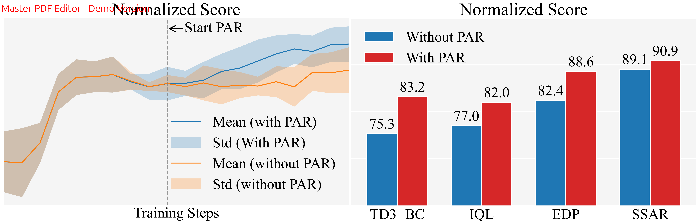

# Proximal Action Replacement (PAR) for Behavior Cloning Actor-Critic in Offline Reinforcement Learning



**Intro:** An easy-to-use plug-and-play training sample replacer. As training progresses, PAR progressively replaces low-value actions with high-value actions generated by a stable actor, reducing the impact of low-value data while broadening the action exploration space.

## Usage Guide

### 1. Reproducing Toy Experiments

Running the toy experiment is straightforward, simply execute:

```bash
python toy_main.py
```

This script will automatically run the toy experiment and generate comparison plots, with results saved to [toy_comparison_grid.pdf](imgs/toy_comparison_grid.pdf).

### 2. Reproducing Experimental Results with WandB (Online Mode)

Use `main.py` for online experiments (requires network connection, data will be uploaded to WandB web interface in real-time).

**Required Parameters:**

- `--wandb_entity`: WandB username or organization name
- `--wandb_project`: WandB project name

**PAR-related Parameters:**

- `--algo`: Algorithm selection, options: `["TD3+BC", "EDP", "BCQ", "IQL", "SSAR"]`
- `--start_synthetic_epoch`: Epoch to start using synthetic data (T_{start} in the paper)
- `--synthetic_percent_range`: Synthetic data percentage range ([P_{min}, P_{max}] in the paper), format as a tuple, e.g., `(0., 0.5)`
- `--LossMultiplier`: Loss multiplier (β in the paper)

**Example Command:**

```bash
python main.py \
    --wandb_entity your_entity \
    --wandb_project your_project \
    --algo TD3+BC \
    --env_name walker2d-medium-replay-v2 \
    --start_synthetic_epoch 500 \
    --synthetic_percent_range "(0., 0.5)" \
    --LossMultiplier 1.1 
```

**Note:** If using online mode, ensure that `WANDB_MODE` in `main.py` is set to `'online'`, or override it via environment variable:

```bash
export WANDB_MODE=online
python main.py ...
```

### 3. Reproducing Experimental Results with WandB (Offline Mode)

Use `main_offline.py` for offline experiments (no network connection required, data saved locally and can be uploaded later).

**Required Parameters:**

- `--wandb_entity`: WandB username or organization name
- `--wandb_project`: WandB project name

**PAR-related Parameters:**

- `--algo`: Algorithm selection, options: `["TD3+BC", "EDP", "BCQ", "IQL", "SSAR"]`
- `--start_synthetic_epoch`: Epoch to start using synthetic data (T_{start} in the paper)
- `--synthetic_percent_range`: Synthetic data percentage range ([P_{min}, P_{max}] in the paper), format as a tuple, e.g., `(0., 0.5)`
- `--LossMultiplier`: Loss multiplier (β in the paper), default value: 1.5

**Example Command:**

```bash
python main_offline.py \
    --wandb_entity your_entity \
    --wandb_project your_project \
    --algo TD3+BC \
    --env_name walker2d-medium-replay-v2 \
    --start_synthetic_epoch 500 \
    --synthetic_percent_range "(0., 0.5)" \
    --LossMultiplier 1.1 
```

### Notice

The specific settings for the key hyperparameters are shown in Table 4 of the paper.
